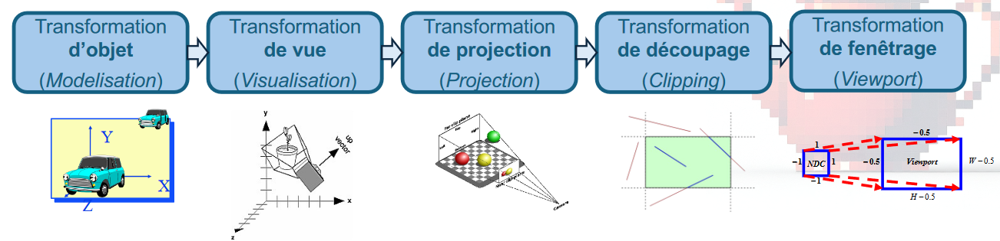
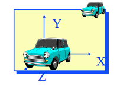
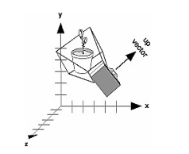
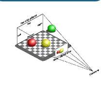
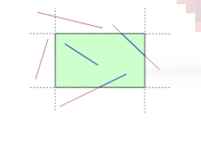
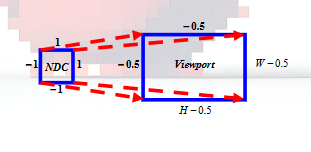
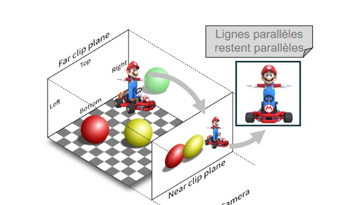
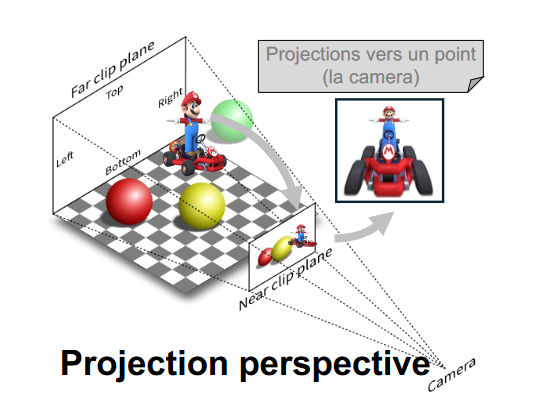
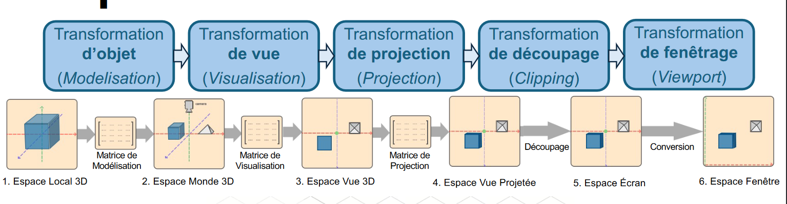

### Chapitre 3: Pipeline de Transformation

#### Objectifs

- Ordonner le pipeline de transformations.
- Interpréter les transformations de modélisation, visualisation, et projection.
- Définir le découpage et la clôture de visualisation.

---

### Pipeline de Transformation Graphique



Le pipeline de transformation est un processus séquentiel qui transforme les coordonnées des objets dans un espace 3D virtuel en coordonnées 2D sur un écran. Les étapes clés incluent la modélisation, la visualisation, la projection, le découpage et le fenêtrage.

---

#### 1. Transformation d'objet (Modélisation)

Cette étape consiste à définir la position, l'orientation et la taille des objets dans l'espace 3D. Chaque transformation individuelle est appliquée pour placer l'objet correctement dans la scène.

- **Matrice de Modèle (Model Matrix)**: Utilisée pour placer l'objet dans l'espace local de l'objet à l'espace du monde.



---

#### 2. Transformation de Vue (Visualisation)

Positionner la caméra dans l'espace 3D. Définir la position de la caméra, la direction de son regard et son orientation.

- **Matrice de Vue (View Matrix)**: Transforme les coordonnées du monde pour qu'elles soient relatives à la position de la caméra.



---

#### 3. Transformation de Projection (Projection)

Projeter les coordonnées 3D sur un plan 2D. Cette étape convertit les coordonnées de l'espace caméra à l'espace image.

- **Matrice de Projection (Projection Matrix)**: Transforme les coordonnées de la vue en coordonnées de projection, soit en projection orthographique, soit en projection perspective.



---

#### 4. Découpage de l'image (Clipping)

Couper les parties des objets qui ne sont pas visibles dans la scène.

- **Clipping**: Élimine les objets ou fragments d'objets en dehors du volume de visualisation.



---

#### 5. Transformation de Fenêtrage (Viewport)

Transforme les coordonnées normalisées en coordonnées de pixels, adaptées à la résolution réelle de l'écran.

- **Matrice de Fenêtrage (Viewport Matrix)**: Transforme les coordonnées dans l'espace normalisé en coordonnées de pixel à l'écran.



---

### Les Mathématiques en Jeu

---

#### Mise à l'échelle en 3D (Scaling)

Multiplie les coordonnées par un facteur d'échelle.

- **Matrice de Mise à l'échelle**:
  \[
  P' = \begin{bmatrix}
  S_x & 0 & 0 & 0 \\
  0 & S_y & 0 & 0 \\
  0 & 0 & S_z & 0 \\
  0 & 0 & 0 & 1
  \end{bmatrix}
  \begin{bmatrix}
  x \\
  y \\
  z \\
  1
  \end{bmatrix}
  \]

#### Rotation en 3D (Rotation)

- **Rotation en 2D**:
  \[
  P' = \begin{bmatrix}
  \cos \theta & -\sin \theta \\
  \sin \theta & \cos \theta
  \end{bmatrix}
  \begin{bmatrix}
  x \\
  y
  \end{bmatrix}
  \]

- **Rotation en 3D**:
  \[
  P' = \begin{bmatrix}
  \cos \theta & -\sin \theta & 0 \\
  \sin \theta & \cos \theta & 0 \\
  0 & 0 & 1
  \end{bmatrix}
  \begin{bmatrix}
  x \\
  y \\
  z
  \end{bmatrix}
  \]

#### Translation en 3D (Translation)

Déplacer un point dans une direction donnée.

- **Translation en 3D**:
  \[
  P' = \begin{bmatrix}
  1 & 0 & 0 & T_x \\
  0 & 1 & 0 & T_y \\
  0 & 0 & 1 & T_z \\
  0 & 0 & 0 & 1
  \end{bmatrix}
  \begin{bmatrix}
  x \\
  y \\
  z \\
  1
  \end{bmatrix}
  \]

#### Translation en 4D (Coordonnées homogènes)

Permet d'exprimer la translation comme un produit matriciel en ajoutant une quatrième composante.

- **Coordonnées homogènes**:
  \[
  P = \begin{bmatrix}
  x \\
  y \\
  z \\
  1
  \end{bmatrix}
  \]

---

### Transformation de Visualisation

#### Positionner la caméra

Configurer la caméra pour voir la scène correctement.

- **Utilisation de LookAt**:
  ```cpp
  void LookAt(double eyeX, double eyeY, double eyeZ, double centerX, double centerY, double centerZ, double upX, double upY, double upZ);
  ```

---

### Transformation de Projection

#### Projection Orthographique

- **Orthogonal**:
  \[
  void Ortho(double left, double right, double bottom, double top, double near, double far);
  \]

  

#### Projection Perspective

- **Perspective**:
  \[
  void Frustum(double left, double right, double bottom, double top, double near, double far);
  \]

  

---

### Transformation de Fenêtrage

#### Fenêtrage (Viewport)

Détail des transformations entre espace de visualisation et espace de l'écran.

- **Fonction glViewport**:
  ```cpp
  void glViewport(GLint x, GLint y, GLsizei width, GLsizei height);
  ```

---



Ces transformations et leurs étapes associées permettent de manipuler et d'afficher des objets 3D sur un écran 2D de manière réaliste en utilisant un ensemble de matrices et de transformations géométriques.
